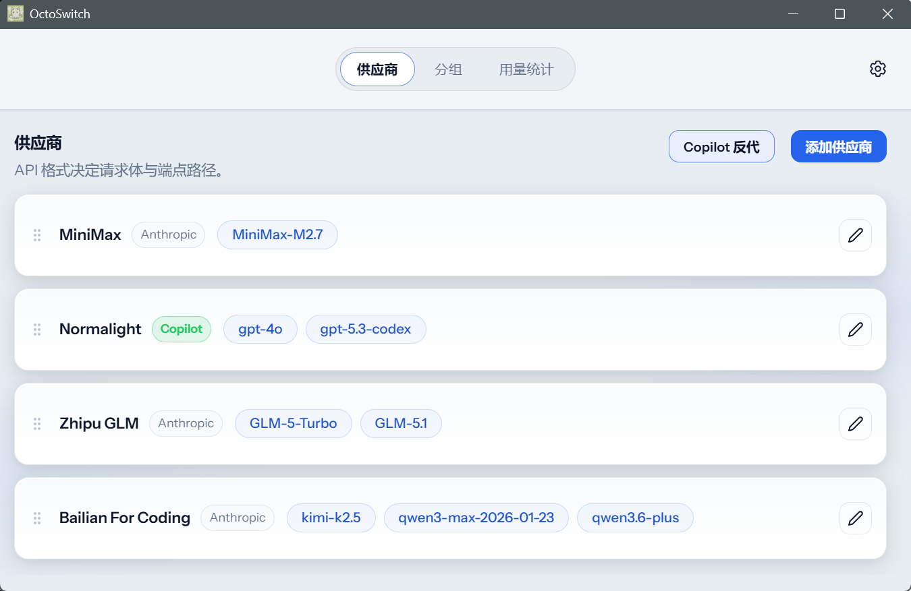
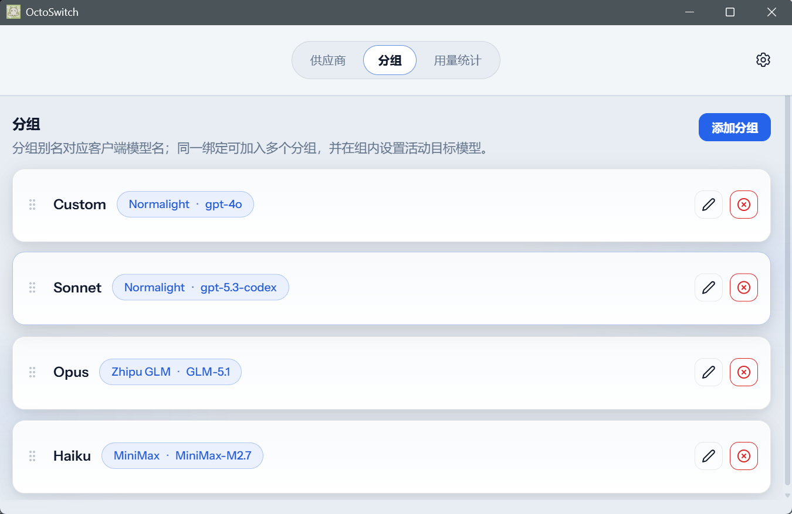
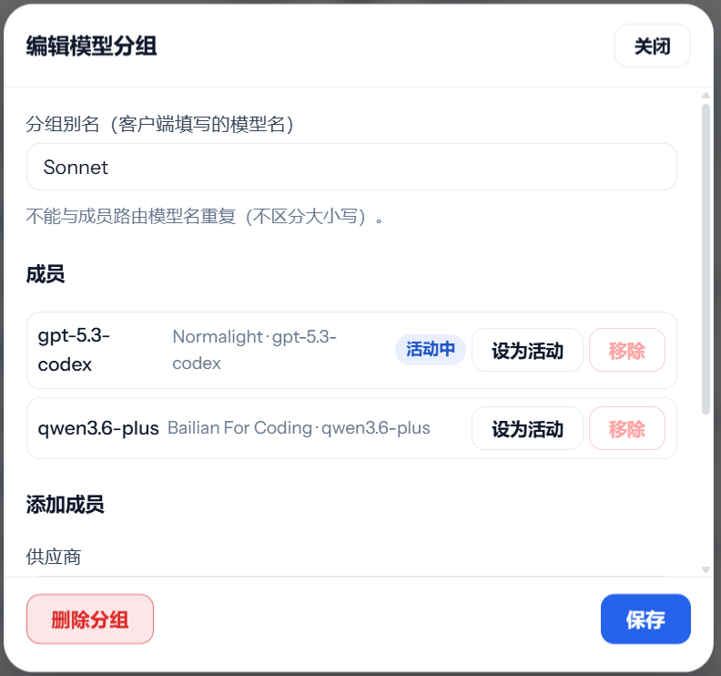
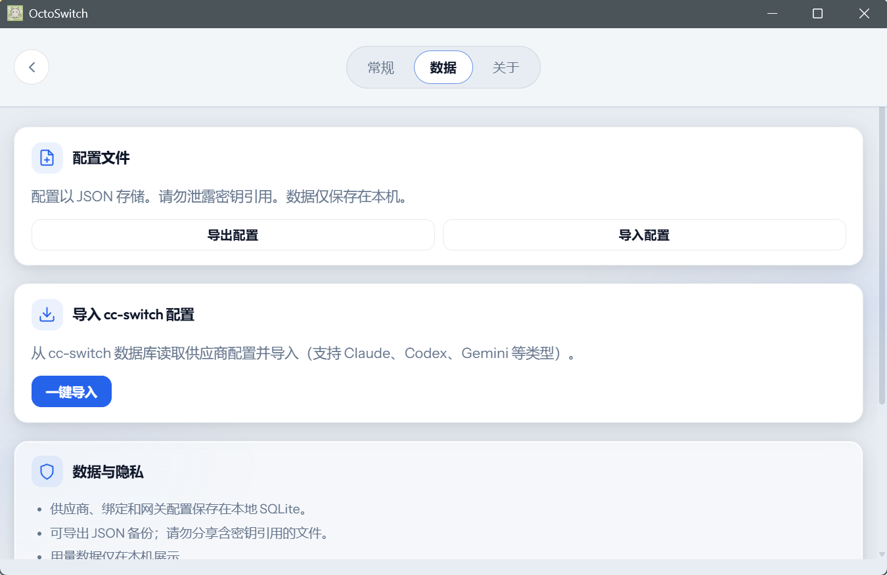
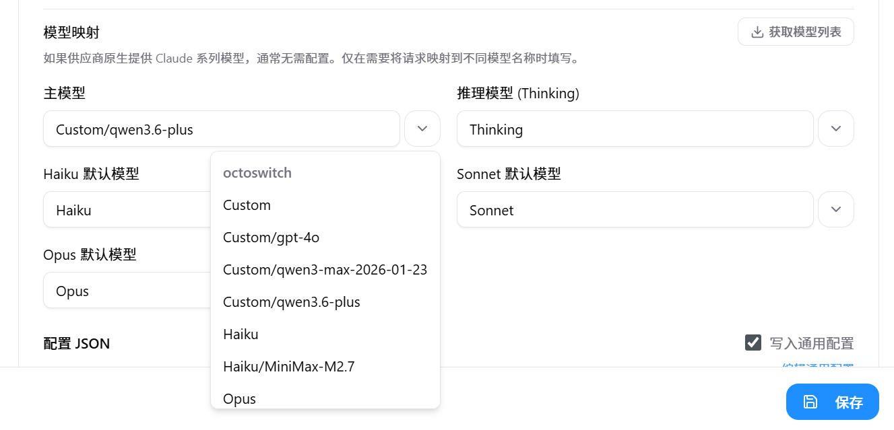

# OctoSwitch

> **聚合多源大模型 API 的本地统一网关** — 一个网关入口，组合多家供应商能力，协同完成任务。

Desktop app and local **LLM API aggregation gateway**. Aggregate multiple upstream providers (OpenAI, Anthropic, GitHub Copilot, and more) behind a single local gateway endpoint, combine their models into groups, and orchestrate multi-source API calls to complete tasks collaboratively.

面向个人使用的桌面应用与本地 **大模型 API 聚合网关**：将多个供应商的大模型 API 统一接入、分组编排，通过**单一网关地址**对外提供服务，灵活组合多源模型能力协同完成任务。客户端只需连接一个本地地址，无需频繁切换配置。

---

## Highlights

- **🔗 多源聚合** — 接入 OpenAI、Anthropic、Copilot 等多协议供应商，统一网关入口
- **🎯 组合调用** — 将不同供应商的模型编组，以分组别名对外暴露，组内成员协同切换
- **🔄 无缝切换** — 客户端无需重启，在组内一键切换活动上游模型
- **📊 可观测性** — 用量指标、健康检查、熔断机制，掌握各供应商状态
- **🔒 隐私优先** — 数据本地 SQLite 存储，密钥不外泄

## How it works

```
Clients (Claude Code, Cursor, etc.)
         │
         │  base_url = http://127.0.0.1:PORT
         │  model    = "Sonnet"  (分组别名 / group alias)
         ▼
┌─────────────────────────────────────────┐
│           OctoSwitch Gateway            │
│                                         │
│  model_group "Sonnet"                   │
│  ├── binding A → OpenAI provider        │
│  ├── binding B → Anthropic provider     │
│  └── binding C → Copilot provider       │
│         ▲                               │
│    active binding = A  ← UI 随时切换    │
└─────────────────────────────────────────┘
         │                    │
    ┌────┴────┐        ┌────┴────┐
    ▼         ▼        ▼         ▼
  OpenAI   Anthropic  Copilot   ...
  (多源供应商，按需组合，协同完成任务)
```

**工作流程：** 客户端只需指向一个本地地址，OctoSwitch 将请求路由到分组中当前活动的上游供应商。在 UI 中切换活动成员，客户端无感知——模型别名始终不变。

---

## Interface

### Providers（供应商）

Configure upstream connections by API format (OpenAI-compatible, Anthropic-style, GitHub Copilot, etc.), attach model bindings, reorder cards, and use **Copilot reverse proxy** or **Add provider** from the toolbar.

<p align="center">
  
  <br /><em>供应商：API 格式、已绑定模型与快捷操作</em>
</p>

### Groups（分组）

Group aliases are the **model names your clients send** (e.g. `Sonnet`, `Opus`). Each group aggregates members from **multiple upstream providers**, with one **active target model**. This is the core of multi-source composition—one alias, many providers behind it.

<p align="center">
  
  <br /><em>分组列表：别名 ↔ 多源上游模型</em>
</p>

### Group editor（编辑模型分组）

Open a group to add members from **different providers**, mark one member as **active**, and keep the client-facing alias stable while you switch backends. Mix and match providers in the same group to combine their strengths—e.g. use Provider A as primary, fall back to Provider B when needed.

<p align="center">
  
  <br /><em>分组内汇聚多供应商成员、设活动模型、与别名校验提示</em>
</p>

### Settings → Data（设置 · 数据）

Export or import JSON config, **one-click import from cc-switch** (reads the local cc-switch database; supports Claude / Codex / Gemini-style entries among others), and local-only SQLite storage with privacy notes on secrets.

<p align="center">
  
  <br /><em>配置导入导出与本地数据说明</em>
</p>

### Import from cc-switch（从 cc-switch 一键导入）

[cc-switch](https://github.com/farion1231/cc-switch) keeps Claude / Codex / Gemini-style provider entries in a local SQLite database. On the same machine, open **Settings → Data** and use **One-click import** (一键导入): OctoSwitch reads those rows and creates matching providers and model bindings. You can then refine groups and upstream model lists in OctoSwitch without retyping endpoints.

若本机已安装并配置 cc-switch，OctoSwitch 可在 **设置 → 数据** 中通过 **一键导入** 读取 cc-switch 本地数据库中的供应商与模型配置（支持 Claude、Codex、Gemini 等类型），导入后在分组与供应商页继续调整即可。

<p align="center">
  
  <br /><em>设置 → 数据：从 cc-switch 导入配置（一键导入）</em>
</p>

---

## Core capabilities

### Multi-provider aggregation（多源供应商聚合）

Connect to multiple upstream providers simultaneously—OpenAI-compatible APIs, Anthropic-style routes, GitHub Copilot, and more. Each provider maintains its own API format and model bindings, all unified behind a single gateway endpoint. Your clients talk to **one address**, OctoSwitch routes to **many providers**.

同时接入多个上游供应商（OpenAI、Anthropic、Copilot 等），统一收敛至单一网关地址，客户端无需分别对接各家。

### Model grouping & collaborative routing（分组编排 · 组合调用）

Group aliases are the **model names your clients send** (e.g. `Sonnet`, `Opus`). Each group aggregates members from **different providers**, with one **active** binding. Switch the active member in the UI—clients keep using the same alias, OctoSwitch transparently routes to the selected upstream. This lets you combine strengths of multiple providers and switch between them on the fly.

分组别名是客户端发送的模型名，组内可汇聚不同供应商的成员，设一个为活动模型。客户端始终使用同一别名，OctoSwitch 透明路由到选定的上游——让你能组合多家供应商的优势，按需切换。

### Additional features

- **Upstream model list:** On model bindings, **fetch model list** (`GET /v1/models` or Copilot's discovery where supported); the UI reports counts and can fill the upstream field.
- **Gateway discovery:** Local gateway exposes **`GET /v1/models`** for tools and scripts (exact shape depends on gateway options, e.g. group-only vs group/member listing).
- **Routing control API:** Local gateway also exposes routing-control endpoints for route-aware clients and scripts:
  - `GET /healthz`
  - `GET /v1/routing/status`
  - `GET /v1/routing/groups/:alias/members`
  - `POST /v1/routing/groups/:alias/active-member`
- **Routing Debug page:** Under **Settings → Routing Debug**, inspect current group/member routing state and switch active members for testing.
- **cc-switch import:** Import providers and bindings from the **cc-switch** SQLite DB on the same machine (**Settings → Data → One-click import**).
- **Usage & resilience:** Usage metrics, health checks, circuit breaker, config backup/restore.
- **i18n & desktop UX:** English / Chinese UI, light & dark theme, tray menu, optional autostart.

### Claude Code routing workflow（Claude Code 路由工作流）

OctoSwitch can act as the routing control plane for Claude Code style multi-model workflows.

Current capabilities in this worktree:

- query current routing status
- switch a group's active member
- address routes with `group/member` model paths
- maintain Claude routing skills in the tracked [`skills/`](skills) folder
- install project-local skills into `.claude/skills/` without tracking `.claude/` in Git
- build distributable plugin artifacts into `plugin-dist/`

Current limitation:

- `/delegate` now launches a real Claude subagent
- however, the requested OctoSwitch route is currently passed as route metadata and worker instructions
- unless Claude exposes explicit Task-tool model binding, this does not guarantee that the subagent runtime is actually pinned to the exact `<group>/<member>` model

#### Recommended group semantics

The current skill set is aligned to your existing group aliases:

- `Sonnet` = default implementation group
- `Opus` = default review group
- `Haiku` = default search / lightweight discovery group

This means the current default workflow does **not** require extra `executor / reviewer / searcher` groups.

Recommended initial targets:

- implementation -> `Sonnet/gpt-5.4`
- review -> `Opus/gpt-5.4`
- search -> `Haiku/MiniMax-M2.7`

#### Routing control API

The local gateway exposes these routing-control endpoints for scripts, skills, and future plugins:

- `GET /healthz`
- `GET /v1/plugin/config`
- `GET /v1/routing/status`
- `GET /v1/routing/groups/:alias/members`
- `POST /v1/routing/groups/:alias/active-member`

#### Routing Debug page

Use **Settings → Routing Debug** to:

- inspect current group/member routing state
- verify whether routing control is enabled
- list members under a group
- switch active members for quick testing

#### Claude skill status

Executable now:

- `/show-routing`
- `/route-activate <group> <member>`
- `/delegate ...` -> defaults to `Sonnet`

Exported plugin namespace:

- `/octoswitch:show-routing`
- `/octoswitch:route-activate <group> <member>`
- `/octoswitch:delegate ...`
- `/octoswitch:task-route ...`

Compatibility alias:

- `/delegate-to ...` (prefer `/delegate --to ...`)

Design-stage extensions:

- `/task-route ...`
- `/delegate-auto ...`

#### Recommended command examples

```text
/show-routing
/route-activate Sonnet gpt-5.4
/route-activate Opus gpt-5.4
/delegate 修复当前问题并运行测试
/delegate --model qwen3.6-plus 调查当前实现差异
/delegate --to Haiku/MiniMax-M2.7 搜索相关入口并总结影响范围
```

#### Install the project-local Claude skills

```powershell
.\scripts\install_claude_skills.ps1
```

You can also install a subset:

```powershell
.\scripts\install_claude_skills.ps1 -Names show-routing,route-activate,delegate
```

For a full initialization suggestion for the current group layout, see [`OCTOSWITCH_GROUP_INIT.md`](OCTOSWITCH_GROUP_INIT.md).

#### Build plugin artifacts

OctoSwitch now supports two distribution modes for routing commands:

- local compatibility skills copied into `.claude/skills/` or cc-switch
- repository-form plugin assets maintained directly in this project repo
- exported plugin snapshots generated into `plugin-dist/` when needed

The tracked plugin source now lives directly in the project root:

- `.claude-plugin/`
- `skills/`

Use this repository-root form as the primary installation and publishing path.

Recommended marketplace maintenance flow:

- add this repository with `/plugin marketplace add <this-repo>`
- maintain `.claude-plugin/marketplace.json` in the project root
- maintain `.claude-plugin/plugin.json` and plugin config samples in the project root
- maintain plugin skill content in `skills/`

The local plugin update check in OctoSwitch now reads the root `.claude-plugin/marketplace.json`, resolves the `octoswitch` plugin repo from that manifest, and then compares this project repo's plugin files with the installed plugin inside `~/.cc-switch/plugins`.

Use the `Skills` page or export flow only when you explicitly need a snapshot:

- `plugin-dist/octoswitch/.claude-plugin/plugin.json`
- `plugin-dist/octoswitch/.claude-plugin/plugin.config.json`
- `plugin-dist/octoswitch/commands/*`
- `plugin-dist/octoswitch/skills/*`
- `plugin-dist/octoswitch/agents/*`
- `plugin-dist/marketplace/.claude-plugin/marketplace.json`

At runtime, plugins should prefer reading live local config from:

- `GET /v1/plugin/config`

The exported `plugin.config.json` is a snapshot fallback and initial default, not the only source of truth.

### Future features（规划中）

- **Multi-model collaborative sub-agent（多模型协同子代理）** — 突破当前分组只能设一个活动模型的限制，让子代理在组内自由切换不同模型，把组内所有模型资源都利用起来——按任务复杂度/成本/延迟自动选择最合适的模型，组合各家所长完成同一任务。客户端仍只对接一个网关地址。
- **Claude Code task-targeted routing（Claude Code 任务定向路由）** — 支持用 Claude Code 指令动态切换激活模型，并为单次任务指定特定模型或分组完成任务。适用于主线程规划、subagent 执行，以及不同任务按需分派到不同上游模型的场景。
- **Claude Code routing skills（Claude Code 路由技能）** — 提供配套 Claude Code Skill，直接操作 OctoSwitch 作为路由控制平面：可查询当前路由状态、切换激活模型或分组、设置默认执行目标，并将单次任务委派到指定模型 / 分组 / group-member。让 Claude Code 成为交互入口，OctoSwitch 负责统一路由、状态管理与后续扩展能力。
- **Codex reverse proxy（Codex 反代）** — 让 Codex CLI 直接对接本地 OctoSwitch 网关，请求透明转发到上游 OpenAI 兼容供应商，Codex 无需单独登录配置。所有 API Key 和上游管理集中在 OctoSwitch 界面中，Codex 请求也可路由到任意模型分组，跨供应商使用 Codex。

---

## macOS

If macOS reports the app as "damaged" after installation, it's due to Gatekeeper flagging the unsigned app. Remove the quarantine attribute:

```bash
sudo xattr -r -d com.apple.quarantine /Applications/OctoSwitch.app
```

This is a known limitation — the app is not code-signed with an Apple Developer ID. The binary itself is intact.

## Requirements

- Node.js 18+
- Rust (stable) and [Tauri 2 prerequisites](https://v2.tauri.app/start/prerequisites/)

## Development

```bash
npm install
npm run tauri:dev
```

## Build

```bash
npm run tauri:build
```

Other scripts: `npm run dev` (frontend only), `npm run build`, `npm run lint`, `npm run preview`.

Package name: `octoswitch`. App data (config, database, logs) lives under the OS local data directory in an **OctoSwitch** folder.

## Stack

React, TypeScript, Vite · Tauri 2 · Rust (axum, SQLite)

## Security

The embedded HTTP gateway is meant for **local** use. It does not implement its own API-key auth on proxy routes; avoid exposing the listen address beyond your machine. Keys and tokens are stored locally; treat exported config like secrets.

## Acknowledgments

Inspired by [cc-switch](https://github.com/farion1231/cc-switch) and [copilot-api](https://github.com/caozhiyuan/copilot-api).

## Copilot disclaimer

> [!WARNING]
> GitHub Copilot support in OctoSwitch relies on **unofficial / reverse-engineered** access to Copilot services (similar in spirit to community Copilot proxies). It is **not supported by GitHub** and **may break unexpectedly**. **Use at your own risk.** Sign-in and request flows may send account-related data or client telemetry to GitHub as part of Copilot usage. Using many Copilot accounts from the same environment can increase risk; prefer isolation (for example separate OS profiles or containers) when in doubt.

> [!WARNING]
> **GitHub Security Notice:**  
> Excessive automated or scripted use of Copilot (including rapid or bulk requests, such as via automated tools) may trigger GitHub's abuse-detection systems.  
> You may receive a warning from GitHub Security, and further anomalous activity could result in temporary suspension of your Copilot access.
>
> GitHub prohibits use of their servers for excessive automated bulk activity or any activity that places undue burden on their infrastructure.
>
> Please review:
>
> - [GitHub Acceptable Use Policies](https://docs.github.com/site-policy/acceptable-use-policies/github-acceptable-use-policies#4-spam-and-inauthentic-activity-on-github)
> - [GitHub Copilot Terms](https://docs.github.com/site-policy/github-terms/github-terms-for-additional-products-and-features#github-copilot)
>
> Use Copilot-related features in OctoSwitch **responsibly** to avoid account restrictions.

**中文简要说明：** Copilot 相关能力基于非官方接口，不受 GitHub 官方支持，可能随时失效；请求与登录过程仍可能向 GitHub 提交与账号或客户端相关的数据。过度自动化、高频或批量调用可能触发滥用检测并导致警告或暂时限制。**请自行承担风险**，并务必阅读上文 GitHub 政策链接。

## License

[MIT](LICENSE)
